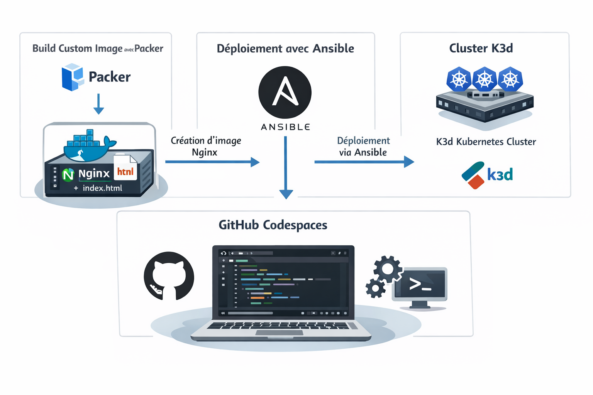

------------------------------------------------------------------------------------------------------
ATELIER FROM IMAGE TO CLUSTER
------------------------------------------------------------------------------------------------------
L’idée en 30 secondes : Cet atelier consiste à **industrialiser le cycle de vie d’une application** simple en construisant une **image applicative Nginx** personnalisée avec **Packer**, puis en déployant automatiquement cette application sur un **cluster Kubernetes** léger (K3d) à l’aide d’**Ansible**, le tout dans un environnement reproductible via **GitHub Codespaces**.
L’objectif est de comprendre comment des outils d’Infrastructure as Code permettent de passer d’un artefact applicatif maîtrisé à un déploiement cohérent et automatisé sur une plateforme d’exécution.
  
-------------------------------------------------------------------------------------------------------
Séquence 1 : Codespace de Github
-------------------------------------------------------------------------------------------------------
Objectif : Création d'un Codespace Github  
Difficulté : Très facile (~5 minutes)
-------------------------------------------------------------------------------------------------------
**Faites un Fork de ce projet**. Si besion, voici une vidéo d'accompagnement pour vous aider dans les "Forks" : [Forker ce projet](https://youtu.be/p33-7XQ29zQ) 
  
Ensuite depuis l'onglet [CODE] de votre nouveau Repository, **ouvrez un Codespace Github**.
  
---------------------------------------------------
Séquence 2 : Création du cluster Kubernetes K3d
---------------------------------------------------
Objectif : Créer votre cluster Kubernetes K3d  
Difficulté : Simple (~5 minutes)
---------------------------------------------------
Vous allez dans cette séquence mettre en place un cluster Kubernetes K3d contenant un master et 2 workers.  
Dans le terminal du Codespace copier/coller les codes ci-dessous etape par étape :  

**Création du cluster K3d**  
```
curl -s https://raw.githubusercontent.com/k3d-io/k3d/main/install.sh | bash
```
```
k3d cluster create lab \
  --servers 1 \
  --agents 2
```
**vérification du cluster**  
```
kubectl get nodes
```
**Déploiement d'une application (Docker Mario)**  
```
kubectl create deployment mario --image=sevenajay/mario
kubectl expose deployment mario --type=NodePort --port=80
kubectl get svc
```
**Forward du port 80**  
```
kubectl port-forward svc/mario 8080:80 >/tmp/mario.log 2>&1 &
```


**Réccupération de l'URL de l'application Mario** 
Votre application Mario est déployée sur le cluster K3d. Pour obtenir votre URL cliquez sur l'onglet **[PORTS]** dans votre Codespace et rendez public votre port **8080** (Visibilité du port).
Ouvrez l'URL dans votre navigateur et jouer !

**téléchargements de packer et ansible et vérification**
```
curl -fsSL https://releases.hashicorp.com/packer/1.14.3/packer_1.14.3_linux_amd64.zip -o packer.zip
unzip -o packer.zip && sudo mv packer /usr/local/bin/ && rm packer.zip
#!/bin/bash
sudo apt-get update
sudo apt-get install -y software-properties-common
sudo add-apt-repository --yes --update ppa:ansible/ansible
sudo apt-get install -y ansible   
packer version && ansible --version
```
**Installation des dépendances ansible et packer et démarrage de docker**
```
sudo systemctl start docker
```
**Création de l'user du groupe docker**
```
sudo usermod -aG docker $USER
newgrp docker
```
**Installation de la collection Ansible essentielle pour gérer les ressources Kubernetes**
```
ansible-galaxy collection install kubernetes.core
```
**construction de l'image custom nginx avec le template packer**
**création fichier nginx.pkr.hcl **
```
packer {
  required_plugins {
    docker = {
      version = ">= 1.0.8"
      source  = "github.com/hashicorp/docker"
    }
  }
}

source "docker" "nginx" {
  image  = "nginx:latest"
  commit = true
}

build {
  sources = ["source.docker.nginx"]

  provisioner "file" {
    source      = "index.html"
    destination = "/usr/share/nginx/html/index.html"
  }
}

```
**construction de l'image custom nginx avec le template packer**
** création de deploiement.yaml et déploiement de K3d **
```
nano deploiement.yaml
```
**Inserez le contenu suivant dedans **
```
apiVersion: apps/v1
kind: Deployment
metadata:
  name: nginx-app
spec:
  replicas: 2
  selector:
    matchLabels:
      app: nginx-app
  template:
    metadata:
      labels:
        app: nginx-app
    spec:
      containers:
      - name: nginx
        image: nginx-custom:latest
        ports:
        - containerPort: 80
---
apiVersion: v1
kind: Service
metadata:
  name: nginx-app-svc
spec:
  type: NodePort
  selector:
    app: nginx-app
  ports:
  - port: 80
    targetPort: 80
```
**playbook ansible à partir de deploiement.yaml**
```
nano playbook.yml
```
**copier le contenu dedans**
```
---
- name: Build & Deploy Nginx App
  hosts: localhost
  connection: local
  gather_facts: no
  tasks:
    - name: Build image Packer
      command: packer build nginx.pkr.hcl

    - name: Deploy sur K3d
      kubernetes.core.k8s:
        state: present
        src: deploiement.yaml

```
**création du fichier inventory.init sur lequel se basera l'execution du playbook**
```
[local]
localhost ansible_connection=local   
```


---------------------------------------------------
Séquence 3 : Exercice
---------------------------------------------------
Objectif : Customisez un image Docker avec Packer et déploiement sur K3d via Ansible
Difficulté : Moyen/Difficile (~2h)
---------------------------------------------------  
Votre mission (si vous l'acceptez) : Créez une **image applicative customisée à l'aide de Packer** (Image de base Nginx embarquant le fichier index.html présent à la racine de ce Repository), puis déployer cette image customisée sur votre **cluster K3d** via **Ansible**, le tout toujours dans **GitHub Codespace**.  

**Architecture cible :** Ci-dessous, l'architecture cible souhaitée.   
  
   
  
---------------------------------------------------  
## Processus de travail (résumé)

1. Installation du cluster Kubernetes K3d (Séquence 1)
2. Installation de Packer et Ansible
3. Build de l'image customisée (Nginx + index.html)
4. Import de l'image dans K3d
5. Déploiement du service dans K3d via Ansible
6. Ouverture des ports et vérification du fonctionnement

---------------------------------------------------
Séquence 4 : Documentation  
Difficulté : Facile (~30 minutes)
---------------------------------------------------
**Complétez et documentez ce fichier README.md** pour nous expliquer comment utiliser votre solution.  
Faites preuve de pédagogie et soyez clair dans vos expliquations et processus de travail.  
   
---------------------------------------------------
Evaluation
---------------------------------------------------
Cet atelier, **noté sur 20 points**, est évalué sur la base du barème suivant :  
- Repository exécutable sans erreur majeure (4 points)
- Fonctionnement conforme au scénario annoncé (4 points)
- Degré d'automatisation du projet (utilisation de Makefile ? script ? ...) (4 points)
- Qualité du Readme (lisibilité, erreur, ...) (4 points)
- Processus travail (quantité de commits, cohérence globale, interventions externes, ...) (4 points) 


